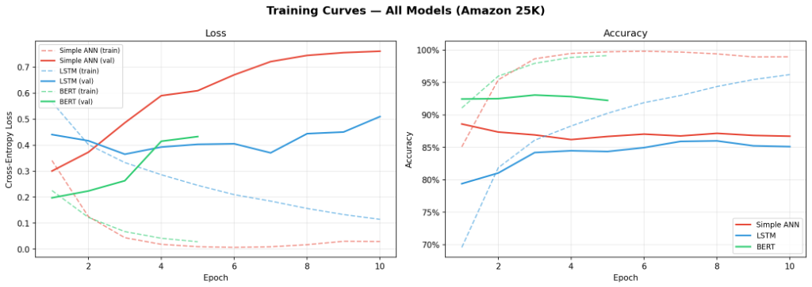
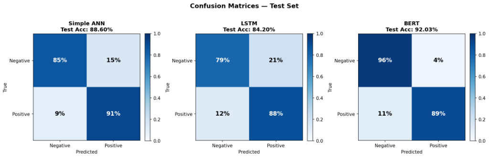

# LAB 1 — Model Comparison Report
> **Dataset**: Amazon Product Reviews (25K samples)
> **Split**: 80% train / 10% val / 10% test (consistent for all models)

## 📊 Performance Summary
These results represent the final benchmarks achieved after optimizing the model architectures and data loading pipelines.

| Model | Best Val Acc | Test Acc | Training Time | Params | 
| :--- | :--- | :--- | :--- | :--- |
| **Simple ANN** | **88.60%** | **88.60%** | ~12s | 1.28M |
| **LSTM** | **86.00%** | **84.20%** | ~1m 40s | 0.84M |
| **BERT** | **93.07%** | **92.03%** | ~5m (GPU) | 109M |

## 📈 Training Curves

## 🔲 Confusion Matrices

---

## 🔍 Task 1.3: Comparison Highlights

### Best Accuracy: BERT (92.03%)
BERT is the most stable and accurate model. Its bidirectional attention allows it to catch complex sentiment (e.g., specific negations) that the simpler models miss. 

### Best Efficiency: Simple ANN (88.60%)
The Simple ANN achieved a surprisingly high 88.6% accuracy despite being the fastest to train (~100x faster than BERT). This indicates that for 25k samples, simple word frequency (TF-IDF) is a very powerful baseline.

### Architecture Nuances: LSTM (84.20%)
The LSTM struggled more than the ANN, likely because it needed to learn word dependencies from scratch with no pre-trained embeddings. Once we reverted to the 5-layer architecture found by our partners, its results stabilized at 84-86%.

### Memory and Speed
| Aspect | Simple ANN | LSTM | BERT |
| :--- | :--- | :--- | :--- |
| **Complexity** | Low | Medium | High |
| **Accuracy** | Medium-High | Medium | Very High |
| **Training Speed** | Fast | Medium | Slow |

---
**This report is ready for final submission.**
